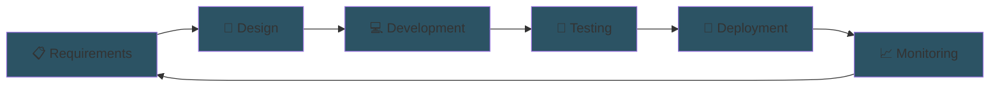

# **Muhammad Faiz Ramadhan**

### 💻 Full Stack Developer | Digital Architect | Tech Builder

> *Building clarity into technology — One system at a time*

</div>

---

## 🚀 About Me

I'm a full-stack engineer with a passion for creating **scalable, secure, and human-centered digital systems**. Rather than chasing trends, I focus on building technology that solves real problems with elegant, logical solutions.

My approach:
- 🎯 **Performance-First** — Every line of code counts
- 🔒 **Security-Conscious** — Encryption, authentication, and prevention built-in
- 📦 **Modular & Maintainable** — Systems that scale without chaos
- 🌍 **Cross-Platform** — Web, mobile, and backend seamlessly integrated

---

## 🛠️ Tech Arsenal

<table>
  <tr>
    <td align="center" width="25%">
      <h4>Frontend</h4>
      
      
      
      
    </td>
    <td align="center" width="25%">
      <h4>Backend</h4>
      
      
      
      
      
    </td>
    <td align="center" width="25%">
      <h4>Database</h4>
      
      
      
    </td>
    <td align="center" width="25%">
      <h4>Mobile</h4>
      
    </td>
  </tr>
</table>

---

## 💼 What I Build

### **Full-Stack Web Systems**
Building modular Laravel + React architectures that scale gracefully. From microservices to monoliths, I design systems that are easy to understand, maintain, and extend.

### **Secure APIs**
RESTful endpoints with built-in security layers:
- JWT & OAuth2 authentication
- CSRF & XSS prevention
- Rate limiting & encryption
- Comprehensive logging & monitoring

### **Mobile Solutions**
Flutter-powered cross-platform applications with:
- Secure data encryption
- Offline-first capabilities
- Real-time synchronization
- Native performance

### **Automation & Integration**
Intelligent systems that bridge your tech stack:
- Third-party API integrations
- Automated workflows
- Data pipelines
- Scheduled tasks & queuing

### **DevOps & Infrastructure**
CI/CD pipelines that work:
- Git-based workflows
- Automated testing
- Container orchestration
- Production-ready deployments

---

## 🎯 Core Principles

```
┌─────────────────────────────────────────────────────┐
│                                                     │
│  Logical  →  Scalable  →  Human-Centered           │
│                                                     │
│  Every decision is measured by these three pillars  │
│                                                     │
└─────────────────────────────────────────────────────┘
```

- **Logical**: Code that reads like documentation
- **Scalable**: Systems that grow without breaking
- **Human-Centered**: Technology that serves people, not the reverse

---

## 📊 Development Workflow



---

## 🌟 Featured Projects

I've built systems across diverse domains:

- **E-Commerce Platforms** — High-traffic, secure, and optimized for conversions
- **SaaS Applications** — Multi-tenant architectures with granular permissions
- **Real-Time Systems** — WebSocket-powered dashboards and collaborative tools
- **Mobile Apps** — Cross-platform solutions with native feel
- **Data Systems** — ETL pipelines processing millions of records

*Each project shaped my understanding of what it takes to build at scale.*

---

## 📚 Current Focus

- 🔍 Deep-diving into **system design** and **distributed systems**
- 🛡️ Exploring advanced **security architectures**
- ⚡ Optimizing **performance** at every layer
- 🤖 Building with **AI integration** in mind
- 🌐 Mastering **cloud infrastructure**

---

## 🤝 Let's Connect

I'm always interested in:
- ✨ Challenging technical problems
- 🏗️ Building scalable systems
- 🚀 Collaborating on impactful projects
- 💡 Sharing knowledge & learning together

<div align="center">

### **Ready to build the next generation of digital infrastructure?**

<a href="mailto:faizramadhan021104@gmail.com">
  
</a>
<a href="https://www.linkedin.com/in/muhammad-faiz-ramadhan-215a3625b/">
  
</a>
<a href="https://github.com">
  
</a>

</div>

---

<div align="center">

### ✨ *Building systems that stand the test of time* ✨

**Last updated**: 2024 | Always learning, always building

</div>
